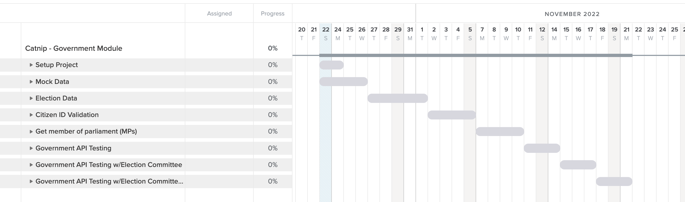
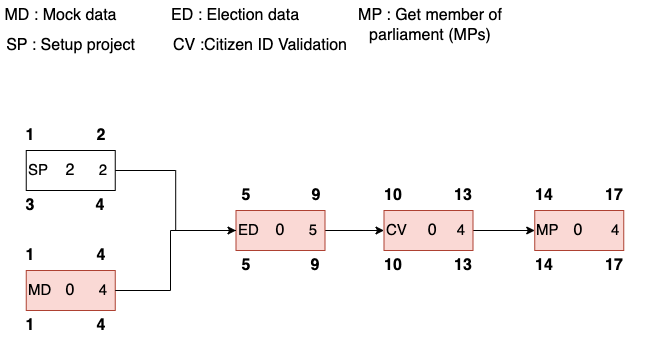

# Catnip' s Configuration Items

## Access Control
Dev (all of us) can access all documents and code. but change need to be approve by PO.

## Change Control

- Documentation : Store draft document in Google Drive. When documents are complete and approved by PO then Documenting on GitHub Page.
- Initiation : Have to inform other members when willing to change.
- Assessment : Members helps to check for correction.
- Analysis : Change have to be approve or denied when discuss in the team.
- Implementation : If the change approved, the process will be implemented by update timeline, deliverable and inform member to acknowledge the change.
- Closure : When initiator signs off the document for closure, the process is finalized and closed for future reference.

## Gantt Chart

## PERT Diagram

